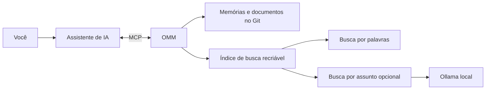

# One Mind Machine (OMM)

OMM é um caderno compartilhado para assistentes de IA. Ele ajuda a guardar decisões, descobertas e próximos passos para que uma nova conversa não precise começar do zero.



Os arquivos guardam a memória. O índice só ajuda a encontrá-la e pode ser recriado.

## Comece em poucos minutos

Você precisa de Python 3.11 ou mais recente. Na pasta do projeto, instale e prepare a OMM:

```sh
python3 -m pip install --user -e .
omm init
omm doctor
```

Guarde uma nota, procure por ela e prepare um resumo para o assistente:

```sh
omm remember --kind fact --title "Exemplo" --content "Uma descoberta importante" --source "docs/notas.md"
omm search "descoberta importante"
omm context "descoberta importante"
```

As notas ficam em arquivos simples. A busca usa um índice rápido, que pode ser recriado. Git guarda o histórico dos arquivos, no computador ou em um servidor Git.

## Usar com um assistente

O MCP é a conexão que permite ao assistente chamar as ferramentas da OMM. Inicie o serviço com Docker Compose:

```sh
docker compose pull
docker compose up -d
```

O Compose baixa a imagem pronta publicada no GitHub Container Registry. Para construir a imagem a partir do código deste computador, use o arquivo opcional `compose.build.yaml`.

Depois, configure o assistente para acessar `http://localhost:8000/mcp` e diga a ele quando consultar e atualizar a memória. Só conectar não faz o assistente usar a OMM automaticamente.

Siga o guia [Como usar a OMM nos agentes](docs/USAR_OMM_NOS_AGENTES.md). Para instruções de conexão, consulte [Ligar um assistente](docs/USAR_MCP.md). Também há guias para [Podman](docs/USAR_PODMAN.md) e [o painel web](docs/PAINEL_WEB.md).

Por padrão, a OMM usa busca textual local. A busca semântica é opcional: em vez de exigir as mesmas palavras, ela tenta encontrar o mesmo assunto. Na stack Docker, o perfil opcional `semantic` inicia o Ollama e baixa um modelo pequeno para essa tarefa. Veja [como ativar](docs/USAR_MCP.md#busca-semântica-procurar-pelo-assunto). Agentes podem sugerir memórias para aprovação no painel.

Para conferir se a busca encontra exemplos esperados, rode `python3 benchmarks/retrieval_eval.py`. O conjunto usa dados inventados e inclui documentos parecidos para a posição dos resultados importar. Com `--json`, a saída pode ser lida por uma automação; `--min-hit-rate-at-3` e `--min-mrr-at-5` definem limites entre `0` e `1` e fazem o comando terminar com erro se a busca cair abaixo deles (`0.8` significa 80%). O exemplo só mede busca por palavras, sem Ollama.

Para medir tempos com uma coleção inventada, rode `python3 benchmarks/performance_eval.py`. O relatório mostra a criação do índice, busca, montagem de contexto e painel. Os dados são apagados ao terminar; por padrão, a busca medida é a textual e não inclui o Ollama.

## Código e dados ficam separados

O repositório da aplicação guarda o programa. A pasta de dados guarda suas notas, regras, skills e documentos. Essa separação permite atualizar o programa sem apagar suas informações. O índice de busca é recriado a partir dos dados.

O backup em Git é opcional. Pode ficar apenas no computador ou ser enviado a GitHub, GitLab, Gitea ou outro servidor. Veja [backup e restauração](docs/USAR_MCP.md#backup-automatico-no-git-opcional).

Para conferir a sincronização sem salvar ou enviar nada, use `docker compose exec -T omm python -m omm --root /data sync --dry-run`. Para sincronizar de verdade sem abrir o painel, retire `--dry-run` e acrescente `--json` se uma automação precisar ler o resultado. O [guia de backup](docs/USAR_MCP.md#sincronizar-pelo-terminal-ou-por-automacao) também mostra a versão para Podman e explica o que a simulação consegue conferir.

## Palavras que você pode encontrar

- **Memória:** notas escolhidas para serem úteis em outras conversas.
- **Handoff:** um resumo de onde o trabalho parou e o que vem depois.
- **Skill:** instruções para ajudar o assistente em um assunto ou tarefa.
- **RAG:** busca de trechos em documentos. Na OMM, os arquivos são a referência; a busca só ajuda a encontrá-los.

Veja [Como migrar informações](docs/MIGRATION.md) para trazer dados existentes. Para configurações avançadas e decisões técnicas, consulte o [material técnico](docs/technical/README.md).
