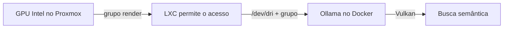

# Usar uma GPU Intel no Ollama do Proxmox

Este guia é opcional. Sem GPU, a busca semântica continua funcionando pela CPU.



## 1. Descubra o número do grupo `render`

No host Proxmox, rode:

```sh
getent group render
ls -ln /dev/dri/renderD128
```

O número depois dos dois-pontos é o GID do grupo. Neste exemplo, é `104`:

```text
render:x:104:root
crw-rw---- 1 0 104 ... /dev/dri/renderD128
```

Neste exemplo, o GID `render` é `104` tanto no host quanto dentro do LXC. Se algum deles mostrar outro número, não copie os mapeamentos abaixo sem ajustá-los.

## 2. Mapeie o grupo para dentro do LXC

Em um LXC não privilegiado, o Proxmox troca alguns números de usuário e grupo por segurança. Sem o mapeamento, a GPU pode aparecer como `nobody` e negar acesso.

No host Proxmox, permita o GID do grupo `render` em `/etc/subgid`. Para o exemplo `104`, rode:

```sh
grep -qxF 'root:104:1' /etc/subgid || echo 'root:104:1' >> /etc/subgid
```

Edite `/etc/pve/lxc/<ID-DO-LXC>.conf` e acrescente estes mapeamentos para o caso em que ambos os GIDs são `104`:

```ini
lxc.idmap: u 0 100000 65536
lxc.idmap: g 0 100000 104
lxc.idmap: g 104 104 1
lxc.idmap: g 105 100105 65431
```

O primeiro mapeamento mantém os usuários do LXC. Ele é necessário junto dos grupos personalizados; sem ele, o LXC pode falhar ao iniciar com erro `cgfsng_chown`. Este exemplo pressupõe o mapeamento padrão `100000:65536` do Proxmox. Se o arquivo já tiver linhas `lxc.idmap`, adapte-as em vez de duplicá-las.

O LXC também precisa expor `/dev/dri`. A linha usada neste exemplo é:

```ini
lxc.mount.entry: /dev/dri dev/dri none bind,optional,create=dir
```

Reinicie o LXC:

```sh
pct stop <ID-DO-LXC>
pct start <ID-DO-LXC>
```

Dentro do LXC, confirme que o grupo do dispositivo agora é `104` (ou o GID que você mapeou), e não `65534`:

```sh
ls -ln /dev/dri/renderD128
getent group render
```

## 3. Passe o dispositivo ao Ollama

Na stack Git do Portainer, mantenha `compose.intel-gpu.yaml` em **Additional paths** e atualize a stack. Esse arquivo passa `/dev/dri`, ativa Vulkan e adiciona ao Ollama o grupo `render`.

`OLLAMA_GPU_RENDER_GID` escolhe o número desse grupo dentro do LXC. O padrão é `104`; defina outro valor nas variáveis da stack se o GID for diferente.

Depois do redeploy, liste o nome do container Ollama:

```sh
docker ps --format 'table {{.Names}}\t{{.Image}}'
```

Use o nome mostrado no lugar de `NOME_DO_CONTAINER_OLLAMA` nestes comandos:

```sh
docker inspect NOME_DO_CONTAINER_OLLAMA --format '{{json .HostConfig.GroupAdd}}'
docker exec NOME_DO_CONTAINER_OLLAMA sh -lc 'id; exec 3<>/dev/dri/renderD128 && echo GPU_DEVICE_OPEN_OK'
```

O primeiro comando deve mostrar o GID, por exemplo `["104"]`. O segundo deve incluir esse grupo em `id` e imprimir `GPU_DEVICE_OPEN_OK`.

## 4. Confirme que o Ollama reconheceu a GPU

Veja os logs:

```sh
docker logs NOME_DO_CONTAINER_OLLAMA 2>&1 | grep -iE 'inference compute|vulkan|gpu'
```

Procure uma linha com `library=Vulkan` e o nome da sua GPU. No teste desta configuração, o Ollama reconheceu `Intel(R) Arc(tm) A380 Graphics (DG2)` e informou cerca de `5.9 GiB` de memória total.

Se `GroupAdd` vier como `null`, a stack ainda não recriou o Ollama com o overlay atualizado. Se aparecer `Permission denied`, confira o GID dentro do LXC e a variável `OLLAMA_GPU_RENDER_GID`.
