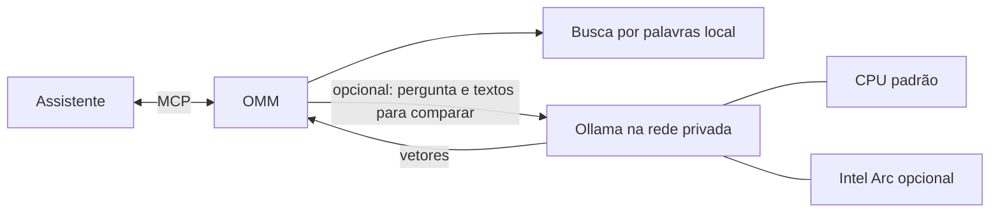

# Ligar um assistente à OMM

O MCP conecta o assistente às ferramentas da OMM. Depois da conexão, também ensine o agente quando consultar e atualizar a memória. Veja o [guia curto para agentes](USAR_OMM_NOS_AGENTES.md).

## Caminho rápido

1. Na pasta da OMM, inicie o serviço:

   ```sh
   docker compose pull
   docker compose up -d
   ```

   Se usar Podman, siga [Usar a OMM com Podman](USAR_PODMAN.md).

2. Cadastre `http://localhost:8000/mcp` no assistente que roda no mesmo computador.

   No Codex:

   ```sh
   codex mcp add omm --url http://localhost:8000/mcp
   ```

   No Claude Code, para todos os projetos do usuário:

   ```sh
   claude mcp add --transport http --scope user omm http://localhost:8000/mcp
   ```

3. Em uma conversa nova, peça ao agente para confirmar que vê as ferramentas. Depois, use o texto do [guia para agentes](USAR_OMM_NOS_AGENTES.md) no `AGENTS.md` do projeto.

Se algo não funcionar, execute o diagnóstico na pasta da OMM:

```sh
omm doctor
```

Em uma instalação Docker Compose, use o terminal do computador:

```sh
docker compose exec omm python -m omm --root /data doctor
```

O comando mostra o que está pronto e o que precisa de atenção. Ele só confere; não altera nem sincroniza arquivos.

O MCP fica disponível enquanto a OMM está ligada. Use `docker compose down` para desligá-la. `localhost` só funciona para programas no mesmo computador; assistentes hospedados na nuvem não conseguem acessá-lo diretamente.

Para economizar contexto, `context` devolve um resumo curto e não inclui documentos-fonte automaticamente. Peça trechos apenas quando precisar conferir um documento.

### Guardar um documento completo na OMM

Quando o agente precisa trazer um Markdown inteiro para a memória compartilhada, ele pode usar a ferramenta MCP `import_source`. Ela grava o documento nos dados da OMM, em `sources/<projeto>/<caminho-original>`, e a busca passa a encontrá-lo. Exemplo: escopo `pkhex-linux` e caminho `docs/PORTING.md` viram `sources/pkhex-linux/docs/PORTING.md`.

O agente precisa abrir o arquivo no projeto de origem e enviar o texto completo à ferramenta. O limite é 20 MiB por arquivo. A OMM recusa senhas, tokens e chaves detectados, e não sobrescreve um arquivo diferente que já exista. Se o destino já tiver exatamente o mesmo conteúdo, ela informa que nada mudou.

Use essa ferramenta para documentos de referência que precisam continuar pesquisáveis, como regras, handoffs, roadmaps e relatórios. Ela não transforma uma lista de links em conteúdo importado. Para outros formatos, guarde uma versão Markdown quando isso preservar o conteúdo com fidelidade e registre a origem original no próprio documento.

## Busca semântica: procurar pelo assunto

A busca comum encontra palavras que aparecem na anotação. A busca semântica tenta encontrar **o mesmo assunto, mesmo quando a pergunta usa outras palavras**. Por exemplo, “como evito perder decisões entre conversas?” pode encontrar uma anotação sobre memória compartilhada. Ela ajuda a procurar; não garante que entendeu certo. Confira a anotação e sua origem antes de confiar nela.

Para fazer essa busca, a OMM usa o Ollama com o modelo `embeddinggemma`. O modelo transforma textos em números para comparar os assuntos. Ele não escreve respostas. A OMM continua sendo dona dos arquivos; o índice de busca pode ser recriado.



Semântica é opcional: a busca normal continua funcionando se o Ollama estiver desligado.

### Ativar na stack Docker ou Portainer

Na configuração da stack, junte `semantic` aos perfis que você já usa. Se também usa backup, por exemplo, fica `backup,semantic`. Adicione estas variáveis:

```dotenv
COMPOSE_PROFILES=semantic
OMM_SEMANTIC_ENABLED=true
OMM_EMBEDDING_URL=http://ollama:11434/api/embed
OMM_EMBEDDING_MODEL=embeddinggemma
OMM_EMBEDDING_TIMEOUT=120
```

Se já usa o perfil `backup`, mantenha os dois: `COMPOSE_PROFILES=backup,semantic`. Depois, atualize a stack. Ela inicia o Ollama e baixa o modelo na primeira vez (cerca de 622 MB). A tarefa de instalação pode aparecer como concluída/parada no Portainer; isso é normal. O modelo fica em um volume separado e sobrevive a atualizações da aplicação. O Ollama fica com os recursos de nuvem desligados nesta stack.

A OMM conversa com o Ollama por dentro da rede Docker. A porta 11434 não fica aberta para os outros computadores e os recursos de nuvem do Ollama ficam desligados. Por padrão, ele usa CPU; GPU não é necessária para começar. Para usar uma Intel Arc passada ao LXC, adicione `compose.intel-gpu.yaml` como arquivo adicional da stack no Portainer. Em LXC não privilegiado, o Proxmox também precisa mapear o grupo `render` do host para o LXC. Veja o [guia curto de GPU Intel no Proxmox](GPU_INTEL_PROXMOX.md). Se o LXC estiver com pouca memória livre, confira o uso antes de aumentar o limite.

Na primeira busca de cada escopo (global ou projeto), a OMM prepara os vetores daquele escopo e guarda os já preparados para os outros. Essa primeira preparação pode demorar; depois, ela reaproveita os vetores e só atualiza o que mudou. No MCP, `semantic_search` responde `status=building` enquanto prepara o índice, em vez de manter a conversa esperando. Consulte `semantic_index_status`; quando retornar `ready`, repita a busca. A busca normal continua disponível durante a preparação. `OMM_EMBEDDING_TIMEOUT=120` dá ao Ollama até dois minutos para responder a cada lote, inclusive quando ele precisa carregar ou aquecer o modelo. O modo de busca deve ser `all`, `memory` ou `sources`. Só a ferramenta `semantic_search` usa o Ollama; a busca normal continua local e não chama esse serviço. O texto das memórias e fontes é enviado ao Ollama local para gerar as comparações; não é enviado a um serviço externo por esta configuração. Se trocar o endereço por um serviço remoto, os textos sairão da sua rede. O modelo ocupa cerca de 622 MB e precisa de Ollama 0.11.10 ou mais recente ([detalhes do modelo](https://ollama.com/library/embeddinggemma)).

Quando habilitada, o agente pode chamar `semantic_search` se a busca comum não encontrar algo que parece estar na memória. Na linha de comando, use `omm semantic-search "sua pergunta"`; para refazer manualmente o índice, use `omm semantic-rebuild`. Esses comandos da CLI esperam a reconstrução terminar.

### Criar ou atualizar skills e papéis

As skills ensinam um jeito reutilizável de trabalhar. Os papéis explicam a função de um especialista ou subagente. O agente pode consultar `list_skills` / `get_skill` e `list_roles` / `get_role`, e agora também gravar essas orientações com `save_skill` e `save_role`.

Para criar, envie um nome e o texto completo. Skills precisam começar com metadados `name` e `description`; papéis podem usar subpastas, como `open-gbp/planner`. Para atualizar, leia o arquivo atual e copie o `sha256` devolvido na lista como `expected_sha256`. Assim, uma sessão antiga não apaga silenciosamente uma edição mais nova. O texto é validado para bloquear credenciais conhecidas e tem limite de 1 MiB.

Essas ferramentas só alteram os dados persistentes da OMM, em `skills/` e `memory/roles/`. Elas não criam nem iniciam subagentes, não alteram a topologia automaticamente e não sincronizam o backup Git. Depois da edição, confira o resultado com `get_skill` ou `get_role`; o backup será sincronizado pelo procedimento normal quando você decidir.

## Perfis da stack

`COMPOSE_PROFILES` escolhe quais serviços extras a stack inicia. Os nomes disponíveis são:

- vazio: só a aplicação OMM;
- `backup`: inicia o serviço que faz cópias no Git. Também é preciso `OMM_GIT_BACKUP_ENABLED=true`;
- `semantic`: inicia Ollama e baixa o modelo de busca. Também é preciso `OMM_SEMANTIC_ENABLED=true`;
- `backup,semantic`: inicia os dois extras.

Para GPU Intel, mantenha esses perfis e adicione `compose.intel-gpu.yaml` em **Additional paths** da stack Git. Sem esse arquivo extra, a busca semântica usa CPU.

Escreva o valor em `.env` ou nas variáveis da stack no Portainer. Se já usa `backup`, acrescente `,semantic`; não apague `backup`.

## Dados e atualizações

O código da OMM e os dados ficam separados. `OMM_DATA_PATH` aponta para a pasta de dados, que contém memórias, skills e documentos. A busca é um índice reconstruível; ela não substitui esses arquivos.

Para atualizar a aplicação, entre na pasta dela e execute:

```sh
git pull --ff-only
docker compose pull
docker compose up -d
```

O Compose usa a imagem OCI publicada no GitHub Container Registry; isso evita precisar de um serviço de build no deploy. Com os dados em uma pasta persistente, atualizar a aplicação não apaga a memória. Se usar o perfil `backup`, acrescente-o aos dois comandos.

Para construir a imagem a partir do código local, junte `-f compose.build.yaml` aos comandos do Compose, por exemplo: `docker compose -f compose.yaml -f compose.build.yaml up --build -d`.

## Backup no Git (opcional)

O backup guarda versões das memórias, skills e documentos. Por padrão, ele fica desligado. Para configurá-lo, copie `.env.example` para `.env` e ajuste:

```dotenv
COMPOSE_PROFILES=backup
OMM_GIT_BACKUP_ENABLED=true
OMM_GIT_BACKUP_RESTORE=true
OMM_GIT_BACKUP_PUSH=true
OMM_GIT_BACKUP_REPOSITORY_URL=https://git.example.com/usuario/omm-dados.git
OMM_GIT_BACKUP_BRANCH=main
OMM_GIT_BACKUP_USERNAME=SEU_USUARIO
OMM_GIT_BACKUP_TOKEN=SEU_TOKEN
```

O endereço pode apontar para GitHub, GitLab, Gitea ou outro servidor Git. Para manter a cópia só neste computador, deixe o envio desligado e use uma pasta de dados que seja repositório Git. Nunca publique o token nem o coloque no endereço do repositório.

O serviço faz backup no horário definido por `OMM_GIT_BACKUP_SCHEDULE` (padrão: todo dia às 03:00, horário de São Paulo). Para conferir mensagens, use `docker compose logs -f omm-backup`.

Na primeira inicialização, o restore automático baixa os dados se a pasta estiver vazia. O índice de busca é recriado. Se os dados já existirem, a OMM não os substitui automaticamente.

No painel, **Sincronizar backup** salva as mudanças locais e busca novidades. **Atualizar** apenas recarrega a página. Se uma mudança não puder ser juntada com segurança, a OMM preserva uma cópia em `memory/imports/sync-recovery/` para revisão.

### Sincronizar pelo terminal ou por automação

Também é possível fazer a mesma sincronização sem abrir o painel. Abra um terminal na pasta que contém `compose.yaml` e `.env` e use o comando da ferramenta de containers que você instalou:

```sh
docker compose exec -T omm python -m omm --root /data sync
```

`omm` é o nome do serviço no arquivo Compose padrão. Se você mudou esse nome, troque-o no comando. Por exemplo, para um serviço chamado `ct-omm`:

```sh
docker compose exec -T ct-omm python -m omm --root /data sync
```

Com Podman, use:

```sh
podman compose exec -T omm python -m omm --root /data sync
```

Se a stack foi criada no Portainer e o arquivo `compose.yaml` não está disponível no servidor, conecte-se ao servidor e use o nome do container principal:

```sh
docker ps --format '{{.Names}}'
docker exec NOME_DO_CONTAINER python -m omm --root /data sync
```

Troque `NOME_DO_CONTAINER` pelo nome mostrado no primeiro comando. Se você já abriu o terminal de dentro do container no Portainer, execute somente `python -m omm --root /data sync`.

Antes de sincronizar, você pode conferir o que aconteceria sem salvar nada:

```sh
docker compose exec -T omm python -m omm --root /data sync --dry-run
```

Essa simulação confere os arquivos locais e consulta qual é o último commit no backup. Ela não cria commit, não baixa arquivos, não mescla e não envia mudanças. Ela também não consegue garantir que a sincronização real ficará livre de conflitos; isso só é confirmado durante a sincronização.

Para automações que precisam ler um resultado previsível, acrescente `--json`:

```sh
docker compose exec -T omm python -m omm --root /data sync --dry-run --json
```

O JSON informa se foram encontrados bloqueios, quais arquivos da OMM mudaram e se as versões local e remota parecem estar atualizadas, adiantadas ou divergentes. Se o remoto tiver avançado desde a última atualização local, a relação aparece como desconhecida: para manter a simulação sem alterações, ela não baixa os novos arquivos. A simulação não verifica conflitos de conteúdo.

O comando salva as mudanças locais, busca as novidades do Git e envia o resultado ao repositório configurado. Ele usa as mesmas variáveis de acesso já definidas para a OMM; não coloque o token no comando. A opção `-T` permite usar o comando em tarefas automáticas, sem abrir um terminal interativo.

Na sincronização real, `--json` inclui quantos conflitos foram preservados e onde a OMM guardou uma cópia local para revisão. Uma falha de sincronização ou uma simulação com bloqueios termina com código de saída `2`.

Ao terminar, a OMM mostra uma mensagem de sucesso. Se algo der errado, ela mostra o motivo e termina com um código de erro, que um script pode detectar. Exemplo:

```sh
if docker compose exec -T omm python -m omm --root /data sync; then
  echo "Backup sincronizado."
else
  echo "A sincronização falhou; confira a mensagem acima."
  exit 1
fi
```

O comando só funciona se a OMM estiver configurada para acessar um repositório Git. A sincronização manual sempre tenta enviar as mudanças; `OMM_GIT_BACKUP_PUSH=false` desliga apenas o envio do backup agendado.

### Restaurar manualmente (avançado)

Use somente com uma pasta de dados vazia:

```sh
docker compose --profile backup run --rm --no-deps omm-backup \
  python -m omm --root /data restore \
  --from https://git.example.com/usuario/omm-dados.git --branch main
```

Para uma instalação em servidor, veja o guia avançado [Instalar no Proxmox](INSTALAR_PROXMOX.md).

## Segurança do painel

O painel pode ser protegido com usuário e senha no `.env`:

```dotenv
OMM_WEB_USERNAME=omm
OMM_WEB_PASSWORD=ESCOLHA_UMA_SENHA_LONGA
```

Essa senha protege o painel, mas não o MCP. Mantenha as conexões em uma rede privada ou VPN. Não exponha as portas à internet sem HTTPS e uma camada de proteção adequada.

### Proteger o MCP quando usar pela rede

O token é opcional: sem ele, o MCP continua funcionando sem pedir uma chave. No mesmo computador, normalmente deixe `OMM_MCP_TOKEN` vazio. Se quiser exigir uma chave para usar o MCP pela rede, crie uma chave longa:

```sh
python3 -c 'import secrets; print(secrets.token_urlsafe(32))'
```

Coloque a chave em `OMM_MCP_TOKEN` no `.env` da OMM e reinicie o serviço. Só então o assistente precisa enviar a mesma chave no cabeçalho `Authorization`. No Codex, configure a conexão para ler a variável `OMM_MCP_TOKEN` e use:

```sh
codex mcp add omm --url http://SERVIDOR:8000/mcp --bearer-token-env-var OMM_MCP_TOKEN
```

#### Codex Desktop no Linux

Siga estas etapas somente se você ativou `OMM_MCP_TOKEN` na OMM. Sem token no servidor, não precisa configurar essa variável no Codex. Se você abre o Codex pelo menu de aplicativos, ele precisa receber a variável quando a sessão gráfica começa. Um `export` feito em um terminal só vale para aquele terminal e os programas abertos por ele; não atualiza um Codex que já está aberto.

Para disponibilizar a variável aos aplicativos da sessão, abra um terminal e edite `/etc/environment`:

```sh
sudoedit /etc/environment
```

Acrescente esta linha, trocando o texto de exemplo pela chave da OMM:

```text
OMM_MCP_TOKEN=COLE_A_CHAVE_AQUI
```

Escreva somente `NOME=valor`, sem `export`. Salve o arquivo, saia da sessão do Linux e entre novamente. Fechar e reabrir apenas o Codex pode manter o ambiente antigo. Abra-o pelo atalho normal e confirme que as ferramentas da OMM aparecem. Para conferir a variável no terminal sem mostrar a chave:

```sh
if printenv OMM_MCP_TOKEN >/dev/null; then echo "Chave carregada"; else echo "Chave ausente"; fi
```

`/etc/environment` vale para todas as contas locais. Em um computador com outras pessoas, lembre-se de que a chave dá acesso de leitura e escrita à OMM. Se aparecer erro `401`, o servidor foi alcançado, mas a chave ausente ou incorreta não foi aceita.

No Claude Code, use:

```sh
claude mcp add --transport http --scope user \
  --header "Authorization: Bearer $OMM_MCP_TOKEN" \
  omm http://SERVIDOR:8000/mcp
```

Troque `SERVIDOR` pelo nome ou endereço do computador. A chave dá acesso às ferramentas de leitura e escrita da OMM; compartilhe-a apenas com assistentes confiáveis. A chave não substitui HTTPS ou VPN em redes que você não controla.
