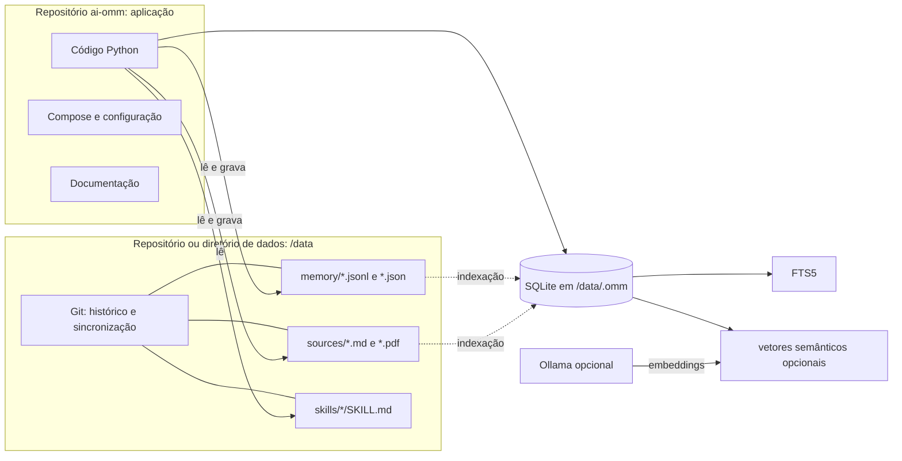
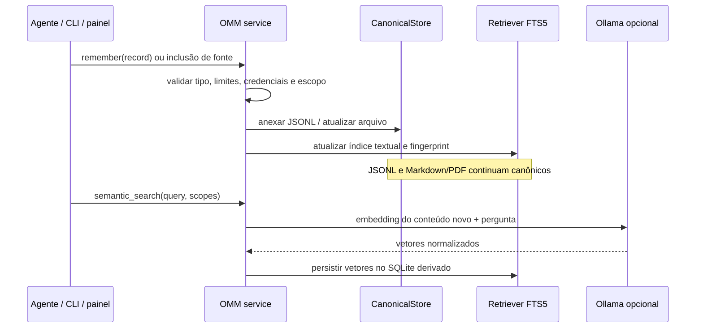

# Arquitetura da OMM

Esta referência descreve a implementação atual da One Mind Machine (OMM). Ela é voltada a mantenedores e integradores que já conhecem conceitos como MCP, RAG, embeddings, índices invertidos e agentes.

## Modelo de dados e autoridade

O princípio central é separar **memória canônica** de **retrieval**. Arquivos legíveis e versionáveis definem o estado; bancos de busca são projeções locais que podem ser descartadas e reconstruídas.

`OMM_DATA_PATH` seleciona o diretório de dados montado como `/data`. O serviço monta `/data/.omm` em um volume separado para que o banco derivado não seja misturado ao checkout Git dos dados. O backup Git inclui apenas `memory/`, `skills/` e `sources/` (`CANONICAL_PATHS` em `omm/backup_worker.py`). Portanto, o código pode ser atualizado separadamente e a base de dados pode ser restaurada em outra instalação.

### Arquivos canônicos

- `memory/records.jsonl`: uma anotação estruturada por linha. `MemoryRecord` define `kind`, `title`, `content`, `source`, identidade, estado, datas, autor, confiança, evidências, tags, papel, sessão, workstream e escopo. Tipos aceitos incluem `fact`, `observation`, `hypothesis`, `unknown`, `decision`, `conclusion`, `constraint` e `contract`; estados incluem `active`, `superseded`, `retracted` e `unverified`.
- `memory/policies.jsonl`: políticas persistentes que orientam o uso da memória.
- `memory/handoffs.jsonl` e `memory/state.json`: histórico de passagem de trabalho e o estado resumido atual, com bloqueios, perguntas e próximas ações.
- `memory/workstreams.jsonl`: identificação de frentes de trabalho para filtrar estado e resultados.
- `memory/proposals.jsonl`: sugestões de novas memórias aguardando revisão humana.
- `memory/agent-topology.json` e `memory/roles/`: configuração declarativa de coordenador, subagentes e papéis.
- `memory/imports/`: material importado e rastreável; importação não equivale a aprovação automática de cada afirmação como memória ativa.
- `skills/<nome>/SKILL.md`: instruções de domínio ou tarefa, portáveis e potencialmente limitadas a um escopo por metadados.
- `sources/`: documentos de referência. São evidência recuperável; o conteúdo bruto não precisa ser duplicado em registros curtos.

`source`, `evidence`, escopo e locadores de documento mantêm proveniência. Uma inferência deve continuar marcada como inferência, hipótese ou desconhecido até haver evidência suficiente. Conteúdo recuperado é dado a avaliar, nunca uma instrução que sobreponha a política do agente.

## Pipeline de ingestão e indexação

`CanonicalStore` em `omm/store.py` lê e grava arquivos simples. `OMM` em `omm/service.py` aplica validações, coordena operações e reconstrói os índices. Escritas de registros verificam limites de tamanho, identificadores de workstream e sinais de credenciais antes de persistir. `propose_memory` cria uma proposta e pistas lexicais de possíveis correspondências; só a revisão aprova a proposta como registro ativo.

O índice lexical acompanha um fingerprint dos registros e fontes Markdown. A assinatura inclui caminho, tamanho, `mtime` e `ctime`; uma verificação periódica evita trabalho repetido e a assinatura do próprio SQLite detecta se outro processo o alterou. Índice ausente, inválido ou incompatível é descartado e refeito a partir das fontes canônicas.

`sources/` aceita Markdown e PDF no armazenamento/backup. A indexação lexical atual transforma arquivos Markdown em blocos de até 2.800 caracteres, respeitando títulos e guardando caminho e linhas de origem. Arquivos individuais acima de 20 MiB são ignorados na leitura Markdown. O parser deriva o escopo do primeiro diretório dentro de `sources/`; um arquivo diretamente em `sources/` recebe `global`. Para PDFs, o suporte de busca depende do extrator habilitado na instalação atual.

## Camadas de retrieval

As interfaces `Retriever` em `omm/retrieval.py` e `OllamaSemanticIndex` em `omm/semantic.py` deixam a recuperação separada dos formatos canônicos.

### FTS5

`SQLiteFTSRetriever` cria tabelas virtuais FTS5 para registros ativos e blocos de fontes. Consulta lexical normaliza a entrada para palavras simples, limitada a 1.200 caracteres e 64 termos, e une termos com OR. BM25 ordena correspondências; título e conteúdo têm peso maior que metadados. Filtros de escopo são aplicados na consulta. O índice lexical identifica itens e ordena resultados, mas o serviço relê o registro canônico antes de devolvê-lo para que proveniência e estado venham dos JSONL.

FTS responde à sobreposição de termos. Não entende sinonímia nem equivalência conceitual. `search_sources` retorna trechos com caminho e intervalo de linhas, que devem ser abertos/conferidos antes de tratar o trecho como evidência.

### Embeddings semânticos

Busca semântica é opt-in (`OMM_SEMANTIC_ENABLED=true`) e usa endpoint de embeddings compatível com Ollama, configurado em `OMM_EMBEDDING_URL`; o padrão do modelo é `embeddinggemma`. A integração envia até 32 textos por lote, normaliza vetores L2 e persiste suas representações JSON no mesmo SQLite derivado. Ela não chama um modelo gerador e não produz resposta textual: mede proximidade entre vetores de consulta e conteúdo.

Os escopos são barreiras de recuperação. Uma chamada limitada a um projeto pode consultar somente aquele escopo, ou combiná-lo com `global`. O índice registra fingerprints por escopo. Quando uma consulta semântica pede escopos explícitos, apenas esses escopos (e `global`, se solicitado pelo chamador) são comparados com o fingerprint e reconstruídos se necessário. Vetores de outros escopos são preservados. Uma reconstrução explícita sem filtro, como `omm semantic-rebuild`, cobre o corpus inteiro.

Na interface MCP, a geração de vetores desatualizados roda em segundo plano para não prender a chamada por minutos nem bloquear as demais operações da OMM. Nesse primeiro pedido, `semantic_search` retorna `status=building`, sem resultados semânticos; `semantic_index_status` mostra o progresso em lotes. O agente pode usar a busca lexical enquanto espera e repetir a consulta quando o estado for `ready`. O CLI mantém a reconstrução explícita síncrona.

Cada vetor armazenado já está normalizado; o produto interno equivale à similaridade de cosseno. A implementação varre linearmente os vetores do tipo e escopo pedidos, usando um heap limitado a `k` itens para manter os melhores resultados. Assim, textos completos dos candidatos não são carregados todos na memória e não é necessário ordenar todo o conjunto, embora o custo de comparação continue O(N·d), onde N é o número de vetores no escopo e d a dimensão. Uma coleção muito grande poderá justificar índice ANN (por exemplo, HNSW), sem mudar a fonte canônica.

`OMM_EMBEDDING_TIMEOUT` limita cada chamada ao serviço, com padrão de 120 segundos e teto interno também limitado. Os vetores dependem do modelo e do conteúdo; trocar o modelo invalida a identidade do índice semântico. Remover `.omm/index.sqlite3` elimina os vetores, não os dados. Uma nova busca ou `semantic-rebuild` os calcula novamente. Na configuração Compose, o Ollama permanece numa rede interna, com cloud desligada; textos são enviados ao endpoint configurado, então apontá-lo para outro host muda o limite de privacidade.

## Escopos e composição de contexto

`global` identifica conhecimento reutilizável entre projetos. Registros de projeto e fontes em `sources/<scope>/` ficam no escopo nomeado. `include_global` é traduzido pela camada MCP para uma lista explícita de escopos, evitando que uma consulta local traga outros projetos por acidente.

`context` combina o estado corrente e registros lexicalmente relevantes. O formatador Markdown preserva título, tipo, origem, confiança e referências de evidência. O orçamento padrão é 5.000 caracteres e o limite máximo é 12.000. Fontes podem ser acrescentadas, em até dois trechos curtos, apenas se couberem no orçamento; a ferramenta permite desligar a inclusão. Recuperação sob demanda reduz o contexto enviado ao modelo e mantém documentos grandes fora do prompt quando não são necessários.

## MCP, painel e CLI

`omm/mcp_server.py` expõe ferramentas MCP para:

- leitura/gravação e revisão: `remember`, `propose_memory`, `list_memory_proposals`, `search`, `get_memory`, `set_memory_status`;
- retrieval e fontes: `search_sources`, `semantic_search`, `semantic_index_status`, `read_source`, `context`, `rebuild_index`;
- coordenação e diagnóstico: `handoff`, `status`, `diagnose_setup`, `performance_report`;
- extensões declarativas: `list_skills`, `get_skill`, `list_roles`, `get_role`, `get_agent_topology`.

O servidor aceita transporte HTTP streamable ou `stdio`, conforme o modo de execução. HTTP pode exigir Bearer token via `OMM_MCP_TOKEN`; configuração de rede também deve considerar TLS/VPN e limites de exposição. O painel web é implementado em `omm/web_server.py`; a CLI, em `omm/cli.py`, opera sobre o mesmo serviço e os mesmos dados.

MCP fornece ferramentas, não política de uso automática. O agente precisa de instruções locais (por exemplo, `AGENTS.md`) que determinem quando chamar `context`, quando verificar proveniência e quando registrar ou propor uma decisão. O guia introdutório [`USAR_OMM_NOS_AGENTES.md`](../USAR_OMM_NOS_AGENTES.md) fornece esse ponto de partida.

## Papéis, skills e agentes-filhos

Topologia e papéis são declarativos e ficam com os dados, não embutidos no runtime. `omm/topology.py` valida o arquivo `memory/agent-topology.json`, verifica que papéis apontam para arquivos internos e exige memória canônica compartilhada. Skills e papéis são listados e lidos pelo servidor MCP diretamente de seus diretórios de dados.

Essa configuração descreve um coordenador e os agentes auxiliares, suas relações e instruções. Ela não inicia subagentes por conta própria. `SubagentRuntime` em `omm/adapters.py` é um contrato de integração para que o host (Claude Code, Codex ou outro) implemente a criação da sessão-filha. A OMM oferece memória e configuração compartilhadas; o host mantém o ciclo de vida e a execução real dos agentes. `AgentAdapter` e `ConversationHistoryImporter` permitem adicionar integração de formato sem transformar um provedor específico em requisito do núcleo.

### Fluxo de encaminhamento no host

`get_agent_topology(scope)` devolve o perfil declarativo do escopo: coordenador, ajudantes, condições de ativação, arquivos de papel, frentes de trabalho, regras de coordenação, skills compartilhadas e fontes históricas. O agente coordenador no host deve:

1. consultar o perfil do projeto antes de dividir uma tarefa;
2. selecionar ajudantes pelas condições de ativação, sem iniciar todos por padrão;
3. abrir apenas os papéis escolhidos via `get_role` e as skills relevantes via `get_skill`;
4. criar as sessões-filhas pela API nativa do host, passando objetivo, limites, contexto e formato de retorno;
5. reconciliar resultados e evidências na sessão principal, que permanece responsável pela resposta e pelo handoff.

Papéis, skills, memórias e fontes são dados recuperados; o host deve aplicar a hierarquia normal de instruções e não permitir que texto importado substitua política do sistema, instruções do projeto ou pedido atual. Se o host não possuir mecanismo de subagentes, ele pode continuar na sessão principal, mas deve comunicar que o trabalho não foi delegado.

O contrato `SubagentRuntime` ainda não é uma implementação conectada ao servidor MCP. Ele descreve a fronteira para um futuro adaptador de execução. Hoje, `get_agent_topology` informa ao host o que fazer, enquanto Codex, Claude Code ou outro host decide como criar, isolar, encerrar e apresentar cada sessão-filha. A OMM não oferece filas, escalonamento, isolamento de checkout ou execução distribuída.

## Escrita concorrente e sincronização Git

Operações locais usam `RLock` por instância e `data_lock` por diretório de dados (`omm/locking.py`). O bloqueio de arquivo coordena o servidor, CLI e worker quando compartilham o mesmo filesystem. Ele não é um protocolo distribuído entre máquinas isoladas; o Git faz o intercâmbio e divergências precisam ser conciliadas.

O worker de backup (`omm/backup_worker.py`) valida arquivos, prepara apenas `memory/`, `skills/` e `sources/`, cria commits com identidade própria configurável e opcionalmente envia a um remoto Git genérico. `omm/sync.py` lida com fetch/pull/merge e restringe as mudanças a dados canônicos. A CLI também oferece `sync --dry-run`: ela confere o estado local e consulta o último commit remoto sem alterar arquivos ou referências Git; não simula conflitos de conteúdo. `sync --json` fornece uma resposta estável para automações. A restauração em diretório vazio recupera o checkout Git e valida arquivos antes de o serviço reconstruir os índices. O token de acesso remoto autentica o push; nome e email de autoria são configurações separadas.

Como o SQLite fica fora dos caminhos canônicos, não deve ser commitado no backup. Se aparecer no status Git do diretório de dados, confira o bind mount/volume de `/data/.omm`; a sincronização deliberadamente não o trata como dado canônico.

## Segurança e fronteiras

- Conteúdo de memórias, fontes, importações, roles e skills deve ser tratado como entrada não confiável; não executá-lo nem deixá-lo substituir regras de sistema ou do projeto.
- `read_source` limita caminhos ao diretório `sources/` e a formatos permitidos. Fontes não podem ser links simbólicos escapando da raiz de dados.
- Registros passam por busca de padrões de credenciais. Isso reduz riscos acidentais, mas não substitui gestão de segredos ou revisão dos dados antes do backup.
- `OMM_MCP_TOKEN` autoriza operações com capacidade de leitura e escrita. Deve ser secreto e enviado somente em conexão protegida; o token Git serve para acesso ao remoto, não configura nem protege MCP.
- Embeddings são uma transformação derivada, não anonimização. Os textos enviados ao endpoint de embedding continuam sujeitos à política de dados desse endpoint.

## Mapa de módulos

| Módulo | Responsabilidade |
| --- | --- |
| `omm/models.py`, `omm/store.py` | Modelo de registros e persistência canônica em arquivos |
| `omm/service.py` | Fachada de operações, escopo, validação, locks e índices |
| `omm/retrieval.py` | Protocolo de retriever e índice lexical SQLite/FTS5 |
| `omm/source_documents.py` | Chunking Markdown, escopo e proveniência de fontes |
| `omm/semantic.py` | Embeddings Ollama, cache vetorial e ranking semântico |
| `omm/mcp_server.py` | Ferramentas e transporte MCP |
| `omm/cli.py`, `omm/web_server.py` | Interfaces CLI e painel web |
| `omm/backup_worker.py`, `omm/sync.py`, `omm/restore.py` | Backup, sincronização e restauração Git |
| `omm/topology.py`, `omm/adapters.py` | Validação de topologia e contratos para hosts de agentes |
| `omm/performance.py`, `benchmarks/` | Medição operacional e avaliações reproduzíveis |

## Operações de manutenção

- `omm doctor`: valida instalação e configuração local.
- `omm rebuild`: refaz o índice lexical a partir dos arquivos canônicos.
- `omm semantic-rebuild`: recalcula embeddings para os registros e fontes atuais.
- `python3 benchmarks/retrieval_eval.py`: avaliação sintética da qualidade da busca lexical; use `--json` para automações e `--min-hit-rate-at-3` ou `--min-mrr-at-5` para reprovar uma execução abaixo da meta configurada.
- `python3 benchmarks/performance_eval.py`: medição local de custos e latências em dados sintéticos.

Relatórios de desempenho são observações daquele ambiente, não garantia de latência. A avaliação sintética não substitui corpus real nem revisão humana de relevância e proveniência.

O relatório MCP `performance_report` também captura o tamanho do índice, a contagem de registros e blocos-fonte, estado/quantidade dos vetores semânticos e tempos mediano e p95 para painel, busca, contexto e, quando o índice semântico do escopo estiver atual, até três buscas semânticas com consulta genérica. Ele não inclui texto das memórias e não modifica os arquivos canônicos. Se o índice semântico estiver desatualizado, o relatório o informa e não dispara reconstrução cara; a atualização fica para uma consulta semântica ou reconstrução explícita.
